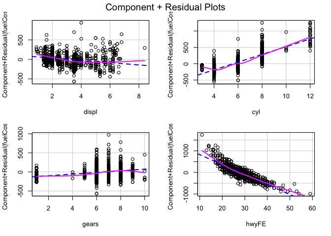
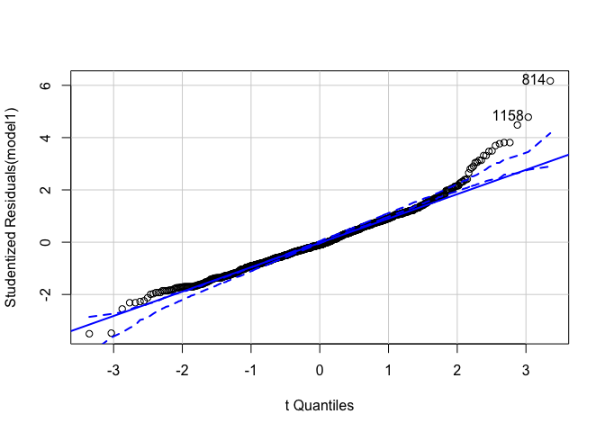
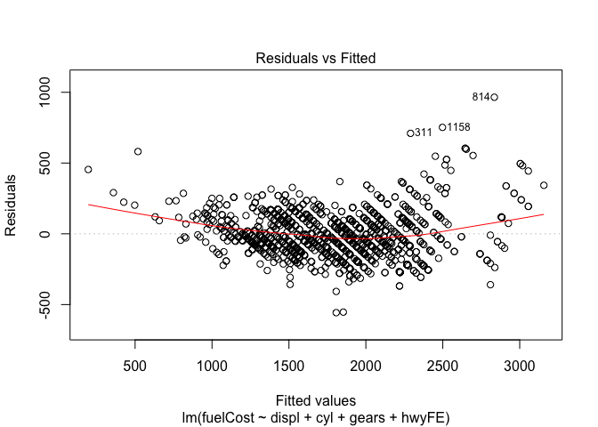
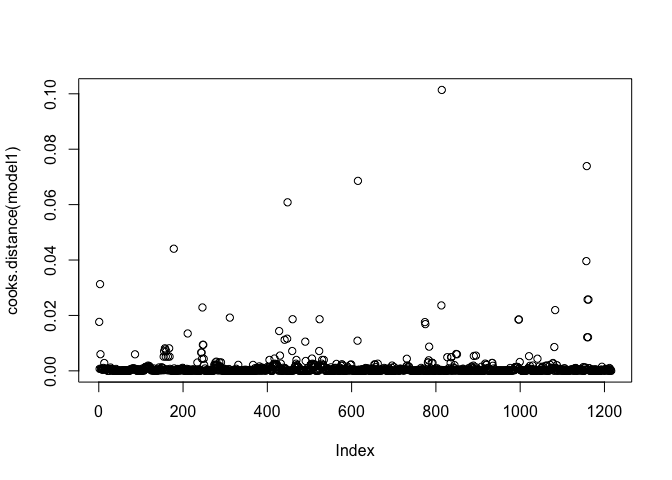
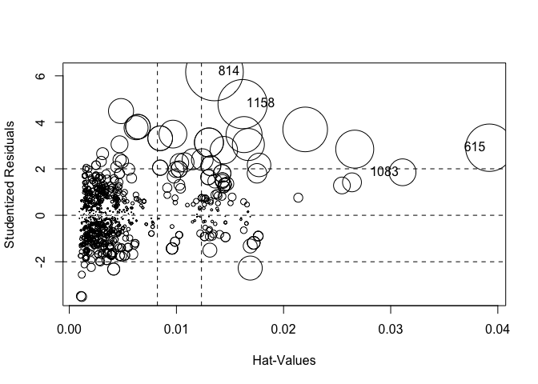
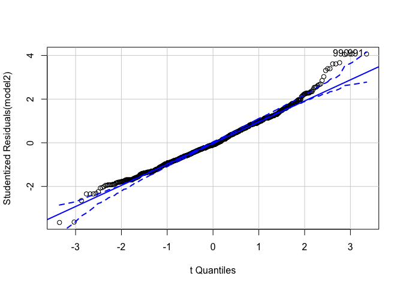

Lab-13 Replication
================
Christopher Prener, Ph.D.
(December 03, 2018)

## Introduction

This notebook replicates Lab-13.

## Dependencies

This notebook requires a variety of packages for assessing regression
models and cleaning data:

``` r
# tidyverse packages
library(dplyr)      # data wrangling
```

    ## 
    ## Attaching package: 'dplyr'

    ## The following objects are masked from 'package:stats':
    ## 
    ##     filter, lag

    ## The following objects are masked from 'package:base':
    ## 
    ##     intersect, setdiff, setequal, union

``` r
library(ggplot2)    # data plotting
library(tibble)     # data wrangling

# statistics packages
library(car)        # regression diagnostics
```

    ## Loading required package: carData

    ## 
    ## Attaching package: 'car'

    ## The following object is masked from 'package:dplyr':
    ## 
    ##     recode

``` r
library(heplots)    # effect sizes
library(lmtest)     # white's test
```

    ## Loading required package: zoo

    ## 
    ## Attaching package: 'zoo'

    ## The following objects are masked from 'package:base':
    ## 
    ##     as.Date, as.Date.numeric

``` r
library(sandwich)   # robust standard errors
library(skimr)      # descriptive statistics

# other packages
library(here)       # file path management
```

    ## here() starts at /Users/chris/GitHub/SOC5050/LectureRepos/lecture-14/assignments/lab-13-replication

``` r
library(stargazer)  # regression output
```

    ## 
    ## Please cite as:

    ##  Hlavac, Marek (2018). stargazer: Well-Formatted Regression and Summary Statistics Tables.

    ##  R package version 5.2.2. https://CRAN.R-project.org/package=stargazer

``` r
library(testDriveR) # data
```

To simplfy printing output, we’re going to use the same `printObs`
function from the lecture:

``` r
printObs <- function(.data, values){
  
  .data %>%
    filter(row_number() %in% values) %>%
    select(id, mfrDivision, carLine, fuelCost, displ, cyl, gears, hwyFE)
  
}
```

## Load Data

This notebook requires data from the `testDriveR` package

``` r
autoData <- auto17
```

## Part 1

### Question 1

First, we need to fit an initial model to assess.

``` r
model1 <- lm(fuelCost ~ displ+cyl+gears+hwyFE, data = autoData)
summary(model1)
```

    ## 
    ## Call:
    ## lm(formula = fuelCost ~ displ + cyl + gears + hwyFE, data = autoData)
    ## 
    ## Residuals:
    ##     Min      1Q  Median      3Q     Max 
    ## -557.23 -103.08  -16.50   98.92  964.88 
    ## 
    ## Coefficients:
    ##             Estimate Std. Error t value Pr(>|t|)    
    ## (Intercept) 2363.275     52.844  44.722  < 2e-16 ***
    ## displ        -29.203      9.580  -3.048  0.00235 ** 
    ## cyl          118.203      6.496  18.197  < 2e-16 ***
    ## gears         21.528      3.098   6.948 6.04e-12 ***
    ## hwyFE        -46.151      1.176 -39.238  < 2e-16 ***
    ## ---
    ## Signif. codes:  0 '***' 0.001 '**' 0.01 '*' 0.05 '.' 0.1 ' ' 1
    ## 
    ## Residual standard error: 159.9 on 1211 degrees of freedom
    ## Multiple R-squared:  0.8847, Adjusted R-squared:  0.8843 
    ## F-statistic:  2323 on 4 and 1211 DF,  p-value: < 2.2e-16

All four of our predictors contribue to explaining variation in fuel
cost. As displacement grows, fuel cost seems to go down, which doesn’t
fit my priors about engine size and fuel costs. I want to dig into this
quickly before we move on:

``` r
modelDispl <- lm(fuelCost ~ displ, data = autoData)
summary(modelDispl)
```

    ## 
    ## Call:
    ## lm(formula = fuelCost ~ displ, data = autoData)
    ## 
    ## Residuals:
    ##     Min      1Q  Median      3Q     Max 
    ## -768.24 -175.18    2.63  157.33 1757.33 
    ## 
    ## Coefficients:
    ##             Estimate Std. Error t value Pr(>|t|)    
    ## (Intercept)  907.346     19.127   47.44   <2e-16 ***
    ## displ        283.831      5.626   50.45   <2e-16 ***
    ## ---
    ## Signif. codes:  0 '***' 0.001 '**' 0.01 '*' 0.05 '.' 0.1 ' ' 1
    ## 
    ## Residual standard error: 267.3 on 1214 degrees of freedom
    ## Multiple R-squared:  0.6771, Adjusted R-squared:  0.6768 
    ## F-statistic:  2545 on 1 and 1214 DF,  p-value: < 2.2e-16

As I would have hypothesized, displacement is *positively* associated
with engine size. There is a sign change between this model and model 1
- a sign of Simpson’s Paradox\! For a “real” project, this would warrent
further exploration.

## Part 2

### Question 2

First, we’ll check for non-linearity using `crPlots()`:

This is the plot for our model:

``` r
crPlots(model1)
```

<!-- -->

Note how I used `warning=FALSE` in the code chunk options to supress
that information so that the plots fit in the notebook. In those plots,
I do not see any serious departures from linear relationships here.

### Question 3

Our model’s residuals should be normally distributed. The `car` package
contains a special `qqPlot` function for assessing this, which includes
additional lines on the plot for assessing deviations from
normality:

``` r
qqplot <- qqPlot(model1)
```

<!-- -->

We’ve got some clear signs of non-normal residuals, which is a violation
of the regression assumptions. We’ll also note the outliers identified
here:

``` r
printObs(autoData, qqplot)
```

    ##      id   mfrDivision                            carLine fuelCost displ
    ## 1 21365 Mercedes-Benz G 550 4x4 (Special Off-Road Model)     3800   4.0
    ## 2 21018       Bentley                       Mulsanne EWB     3250   6.8
    ##   cyl gears hwyFE
    ## 1   8     7    11
    ## 2   8     8    17

### Question 4

Since the residuals are not normally distributed, then we want to use
the White’s Test variant of the Breusch-Pagan
Test.

``` r
bptest(model1, ~ displ * cyl * gears * hwyFE + I(displ^2) + I(cyl^2) + I(gears^2) + I(hwyFE^2), data = autoData)
```

    ## 
    ##  studentized Breusch-Pagan test
    ## 
    ## data:  model1
    ## BP = 348.62, df = 19, p-value < 2.2e-16

The statistically significant result for the White’s Test suggests that
we have signs of homoskedastic errors, which is another violation of the
regression assumptions. We can visualize this with a residual plot:

``` r
plot(model1, which = 1)
```

<!-- -->

There is clear narrowing on the left side of the plot, suggesting
homoskedastic errors are present.

``` r
homoskedastic <- c(311, 1158, 814)

printObs(autoData, homoskedastic)
```

    ##      id   mfrDivision                            carLine fuelCost displ
    ## 1 21311          Ford                            Ford GT     3000   3.5
    ## 2 21365 Mercedes-Benz G 550 4x4 (Special Off-Road Model)     3800   4.0
    ## 3 21018       Bentley                       Mulsanne EWB     3250   6.8
    ##   cyl gears hwyFE
    ## 1   6     7    18
    ## 2   8     7    11
    ## 3   8     8    17

### Question 5

The Durbin-Watson Test identifies the presence of auto-correlation in
our model - the residuals are correlated with each other:

``` r
durbinWatsonTest(model1)
```

    ##  lag Autocorrelation D-W Statistic p-value
    ##    1       0.4888349      1.018156       0
    ##  Alternative hypothesis: rho != 0

This suggests that auto-correlation is present in our model, yet another
violation of the regression assumptions.

### Question 6

We use the square root of the variance inflation factor (“VIF”) to
identify multi-collinearity. Individual values should be less than 10:

``` r
sqrt(vif(model1))
```

    ##    displ      cyl    gears    hwyFE 
    ## 2.846070 2.694206 1.055164 1.540199

This measure indicates that multi-collinearity is not a significant
concern. We also want our mean VIF to be less than 1:

``` r
mean(sqrt(vif(model1)))
```

    ## [1] 2.03391

This indicates that there is some minimal concern that our average level
of multicollinearity is high but not problematically so. We could look
for alternative model specifications if this were a more significant
concern (by either creating scales or by changing the specific
independent variables used).

### Question 7

We violate a number of regression assumptions for normal residuals,
heteroskedastic errors, and auto-correlation. We should consider
re-fitting the model with additional predictors. Alternatively or in
addition, we should re-fit our model using robust standard errors.

## Part 3

### Question 8

The Bonferonni test will identify outliers by observation. The
`outlierTest()` output will show statistically significant observations,
each of which is considered an outlier:

``` r
outlierTest(model1)
```

    ##      rstudent unadjusted p-value Bonferonni p
    ## 814  6.166960         9.4728e-10   1.1519e-06
    ## 1158 4.783611         1.9336e-06   2.3513e-03
    ## 311  4.483760         8.0301e-06   9.7646e-03

We’ve found three potential outliers among our 1,216 observations. We
can learn more about these observations by extracting the row numbers
from the output and then using our `printObs()` function:

``` r
bonferonni <- outlierTest(model1)
bonferonni <- as.numeric(attr(bonferonni$p, "names"))

printObs(autoData, bonferonni)
```

    ##      id   mfrDivision                            carLine fuelCost displ
    ## 1 21311          Ford                            Ford GT     3000   3.5
    ## 2 21365 Mercedes-Benz G 550 4x4 (Special Off-Road Model)     3800   4.0
    ## 3 21018       Bentley                       Mulsanne EWB     3250   6.8
    ##   cyl gears hwyFE
    ## 1   6     7    18
    ## 2   8     7    11
    ## 3   8     8    17

This gives us our first list of potentially problematic observations.
Comparing their values with descriptive statistics would give us a sense
of why these are considered outliers:

``` r
autoData %>%
  select(fuelCost, displ, cyl, gears, hwyFE) %>%
  skim()
```

    ## Skim summary statistics
    ##  n obs: 1216 
    ##  n variables: 5 
    ## 
    ## ── Variable type:integer ─────────────────────────────────────────────────────────────────────────────────────────────────
    ##  variable missing complete    n    mean     sd  p0  p25  p50  p75 p100
    ##       cyl       0     1216 1216    5.59   1.9    3    4    6    6   12
    ##  fuelCost       0     1216 1216 1791.45 470.15 650 1450 1750 2050 3800
    ##     gears       0     1216 1216    6.62   1.56   1    6    6    8   10
    ##     hwyFE       0     1216 1216   27.83   6.01  11   24   27   31   59
    ##      hist
    ##  ▇▁▆▁▃▁▁▁
    ##  ▁▅▇▇▂▁▁▁
    ##  ▁▁▁▁▇▃▅▁
    ##  ▁▅▇▅▂▁▁▁
    ## 
    ## ── Variable type:numeric ─────────────────────────────────────────────────────────────────────────────────────────────────
    ##  variable missing complete    n mean   sd  p0 p25 p50 p75 p100     hist
    ##     displ       0     1216 1216 3.11 1.36 0.9   2   3 3.6  8.4 ▃▇▇▂▂▂▁▁

We’ve got several very high cost vehicles near the bottom of the `hwyFE`
distribution and relatively high values for `cyl` and `gears`.

### Question 4

To calculate leverage, we’ll use the equation:

\(\frac{2*p}{n}\)

We can calculate \(p\) (the number of parameters) and \(n\) (the number
of observations in the model) automatically using the syntax below - we
need to pull information from the `model1` object.

``` r
p <- as.numeric(length(attr(model1$coefficients, "names")))
n <- as.numeric(nrow(model1$model))

leveragePoints2 <- which(hatvalues(model1) > (2*p)/n)

printObs(autoData, leveragePoints2)
```

    ##        id   mfrDivision                            carLine fuelCost displ
    ## 1   20889  Aston Martin                           Rapide S     2450   6.0
    ## 2   20887  Aston Martin                      V12 Vantage S     3000   6.0
    ## 3   20913  Aston Martin                      V12 Vantage S     3500   6.0
    ## 4   20915  Aston Martin             Vanquish, S and Zagato     2600   6.0
    ## 5   21232           BMW                               328d     1150   2.0
    ## 6   21289           BMW                       M760i xDrive     2600   6.6
    ## 7   21086         Dodge                         Challenger     2350   6.4
    ## 8   21053         Dodge                         Challenger     2450   6.4
    ## 9   21095         Dodge                     Challenger SRT     2600   6.2
    ## 10  21111         Dodge                     Challenger SRT     2600   6.2
    ## 11  21087         Dodge                     Challenger SRT     2350   6.4
    ## 12  21054         Dodge                     Challenger SRT     2450   6.4
    ## 13  21088         Dodge                            Charger     2350   6.4
    ## 14  21096         Dodge                        Charger SRT     2600   6.2
    ## 15  21089         Dodge                        Charger SRT     2350   6.4
    ## 16  19960         Dodge                              Viper     3000   8.4
    ## 17  20194          Jeep                        Compass 4X4     1750   2.4
    ## 18  20390          Jeep                        Compass FWD     1550   2.0
    ## 19  20391          Jeep             Grand Cherokee SRT 4x4     2800   6.4
    ## 20  20193          Jeep                        Patriot 4X4     1750   2.4
    ## 21  20389          Jeep                        Patriot FWD     1550   2.0
    ## 22  20841       Ferrari                     F12 Berlinetta     3250   6.3
    ## 23  20840       Ferrari                     F12 Berlinetta     3250   6.3
    ## 24  20819       Ferrari                            F12 TDF     3250   6.3
    ## 25  20257       Ferrari                            F12 TDF     3500   6.3
    ## 26  20839       Ferrari                          GTC4Lusso     3250   6.3
    ## 27  20355       Ferrari                          GTC4Lusso     3250   6.3
    ## 28  20780       Ferrari                   LaFerrari Aperta     3250   6.3
    ## 29  21205          Ford                   C-Max Hybrid FWD      900   2.0
    ## 30  19667          Ford                  Fusion Hybrid FWD      900   2.0
    ## 31  19668       Lincoln                     MKZ Hybrid FWD      900   2.0
    ## 32  20610      Cadillac                              CTS-V     2450   6.2
    ## 33  20046      Cadillac                           Escalade     2150   6.2
    ## 34  20132      Cadillac                       Escalade FWD     2150   6.2
    ## 35  20118     Chevrolet                     C15 Silverado      2150   6.2
    ## 36  21353     Chevrolet                             Camaro     2800   6.2
    ## 37  19909     Chevrolet                             Camaro     2100   6.2
    ## 38  20983     Chevrolet                             Camaro     2600   6.2
    ## 39  19948     Chevrolet                             Camaro     2200   6.2
    ## 40  20825     Chevrolet             City Express Cargo Van     1450   2.0
    ## 41  20021     Chevrolet                           Corvette     2600   6.2
    ## 42  20019     Chevrolet                           Corvette     2200   6.2
    ## 43  20920     Chevrolet                           Corvette     2350   6.2
    ## 44  20020     Chevrolet                           Corvette     2200   6.2
    ## 45  21391     Chevrolet                              Cruze     1100   1.6
    ## 46  21386     Chevrolet                              Cruze     1100   1.6
    ## 47  20283     Chevrolet           G2500 Express  Pass MDPV     2850   6.0
    ## 48  20284     Chevrolet           G3500 Express  Pass MDPV     3050   6.0
    ## 49  20125     Chevrolet                  K15 Silverado FWD     2150   6.2
    ## 50  20924     Chevrolet                             Malibu      800   1.8
    ## 51  20396     Chevrolet                              Spark     1100   1.4
    ## 52  21262     Chevrolet                        Spark Activ     1100   1.4
    ## 53  20757     Chevrolet                                 SS     2600   6.2
    ## 54  20758     Chevrolet                                 SS     2450   6.2
    ## 55  20119           GMC                        C15 Sierra      2150   6.2
    ## 56  20047           GMC                       C1500 Yukon      2150   6.2
    ## 57  20048           GMC                    C1500 Yukon XL      2150   6.2
    ## 58  20285           GMC            G2500 Savana  Pass MDPV     2850   6.0
    ## 59  20286           GMC            G3500 Savana  Pass MDPV     3050   6.0
    ## 60  20127           GMC                     K15 Sierra FWD     2150   6.2
    ## 61  20126           GMC                    K1500 Yukon FWD     2150   6.2
    ## 62  20239           GMC                 K1500 Yukon XL FWD     2300   6.2
    ## 63  20456         Honda                             Accord      750   2.0
    ## 64  19942         Honda                             Accord     1200   2.4
    ## 65  20954         Honda                       Civic 2 Door     1050   1.5
    ## 66  20956         Honda                       Civic 2 Door     1100   2.0
    ## 67  20953         Honda                       Civic 4 Door     1000   1.5
    ## 68  20957         Honda                       Civic 4 Door     1100   2.0
    ## 69  20554         Honda                       Civic 5 Door     1100   1.5
    ## 70  21201         Honda                           CR-V AWD     1250   1.5
    ## 71  21199         Honda                           CR-V AWD     1350   2.4
    ## 72  21200         Honda                           CR-V FWD     1200   1.5
    ## 73  21198         Honda                           CR-V FWD     1300   2.4
    ## 74  20011         Honda                                Fit     1000   1.5
    ## 75  20794         Honda                           HR-V AWD     1250   1.8
    ## 76  20793         Honda                           HR-V FWD     1200   1.8
    ## 77  21298       Hyundai                              Ioniq      650   1.6
    ## 78  21294       Hyundai                         Ioniq Blue      650   1.6
    ## 79  19905       Hyundai                      Sonata HYBRID      900   2.0
    ## 80  19906       Hyundai                   Sonata HYBRID SE      900   2.0
    ## 81  21277        Jaguar                                 XE     1150   2.0
    ## 82  21307        Jaguar                                 XF     1200   2.0
    ## 83  21291           Kia                               Niro      750   1.6
    ## 84  21305           Kia                            Niro FE      750   1.6
    ## 85  20454           Kia                      Optima Hybrid      900   2.0
    ## 86  20157      Maserati                            Levante     2600   3.0
    ## 87  20169      Maserati                          Levante S     2600   3.0
    ## 88  21066 Mercedes-Benz                           AMG G 65     3500   6.0
    ## 89  20798 Mercedes-Benz                           AMG S 65     2600   6.0
    ## 90  20721 Mercedes-Benz                          AMG SL 65     2600   6.0
    ## 91  21270 Mercedes-Benz                              G 550     3250   4.0
    ## 92  21365 Mercedes-Benz G 550 4x4 (Special Off-Road Model)     3800   4.0
    ## 93  20784 Mercedes-Benz                      Maybach S 600     2600   6.0
    ## 94  20783 Mercedes-Benz                              S 600     2600   6.0
    ## 95  20870 Mercedes-Benz             S 65 AMG (Convertible)     2600   6.0
    ## 96  21081 Mercedes-Benz                   S 65 AMG (Coupe)     2600   6.0
    ## 97  19347    Mitsubishi                             Mirage      950   1.2
    ## 98  19472    Mitsubishi                          Mirage G4     1000   1.2
    ## 99  20884        Nissan                             Altima     1200   2.5
    ## 100 20824        Nissan                    NV200 Cargo Van     1450   2.0
    ## 101 21248        Nissan                     NV200 Nyc Taxi     1550   2.0
    ## 102 20814        Nissan                        Pathfinder      1600   3.5
    ## 103 20815        Nissan                     Pathfinder FWD     1650   3.5
    ## 104 20680        Nissan            Pathfinder FWD Platinum     1750   3.5
    ## 105 21136        Nissan                              Quest     1650   3.5
    ## 106 21068        Nissan                          Rogue AWD     1350   2.5
    ## 107 21067        Nissan                          Rogue FWD     1250   2.5
    ## 108 21020        Nissan                             Sentra     1150   1.8
    ## 109 20637        Nissan                              Versa     1100   1.6
    ## 110 20829   Rolls-Royce                               Dawn     3000   6.6
    ## 111 20828   Rolls-Royce                              Ghost     3000   6.6
    ## 112 20830   Rolls-Royce                          Ghost EWB     3000   6.6
    ## 113 19808   Rolls-Royce                            Phantom     3000   6.7
    ## 114 19809   Rolls-Royce                      Phantom Coupe     3000   6.7
    ## 115 19810   Rolls-Royce             Phantom Drophead Coupe     3000   6.7
    ## 116 19811   Rolls-Royce                        Phantom EWB     3000   6.7
    ## 117 20831   Rolls-Royce                             Wraith     2800   6.6
    ## 118 19787        Subaru                           Forester     1300   2.5
    ## 119 20866         Lexus                            CT 200H      900   1.8
    ## 120 20433        Toyota                    Camry Hybrid LE      900   2.5
    ## 121 20434        Toyota                Camry Hybrid XLE/SE      950   2.5
    ## 122 20492        Toyota                            Corolla     1150   1.8
    ## 123 20498        Toyota                     Corolla LE ECO     1100   1.8
    ## 124 20493        Toyota                     Corolla LE ECO     1100   1.8
    ## 125 20508        Toyota                              Prius      700   1.8
    ## 126 21223        Toyota                            Prius C      800   1.5
    ## 127 20503        Toyota                          Prius ECO      650   1.8
    ## 128 20867        Toyota                            Prius V      900   1.8
    ## 129 20868       Bentley                           Bentayga     2800   6.0
    ## 130 20817       Bentley                     Continental GT     2800   6.0
    ## 131 20821       Bentley         Continental GT Convertible     2800   6.0
    ## 132 20820       Bentley                        Flying Spur     2800   6.0
    ## 133 20706       Bentley                           Mulsanne     3000   6.8
    ## 134 21018       Bentley                       Mulsanne EWB     3250   6.8
    ## 135 20069   Lamborghini                    Aventador Coupe     3250   6.5
    ## 136 21106   Lamborghini            Aventador Coupe LP740-4     3500   6.5
    ## 137 20122   Lamborghini                 Aventador Roadster     3250   6.5
    ## 138 21105   Lamborghini         Aventador Roadster LP740-4     3500   6.5
    ##     cyl gears hwyFE
    ## 1    12     8    21
    ## 2    12     7    18
    ## 3    12     7    16
    ## 4    12     8    21
    ## 5     4     8    43
    ## 6    12     8    20
    ## 7     8     8    25
    ## 8     8     6    23
    ## 9     8     8    22
    ## 10    8     6    21
    ## 11    8     8    25
    ## 12    8     6    23
    ## 13    8     8    25
    ## 14    8     8    22
    ## 15    8     8    25
    ## 16   10     6    19
    ## 17    4     1    23
    ## 18    4     1    26
    ## 19    8     8    19
    ## 20    4     1    23
    ## 21    4     1    26
    ## 22   12     7    16
    ## 23   12     7    16
    ## 24   12     7    15
    ## 25   12     7    15
    ## 26   12     7    17
    ## 27   12     7    17
    ## 28   12     7    15
    ## 29    4     1    38
    ## 30    4     1    41
    ## 31    4     1    38
    ## 32    8     8    21
    ## 33    8     8    22
    ## 34    8     8    20
    ## 35    8     8    21
    ## 36    8    10    20
    ## 37    8     8    27
    ## 38    8     6    20
    ## 39    8     6    25
    ## 40    4     1    26
    ## 41    8     8    23
    ## 42    8     8    26
    ## 43    8     7    22
    ## 44    8     7    25
    ## 45    4     9    47
    ## 46    4     6    52
    ## 47    8     6    16
    ## 48    8     6    16
    ## 49    8     8    20
    ## 50    4     1    43
    ## 51    4     1    38
    ## 52    4     1    37
    ## 53    8     6    22
    ## 54    8     6    22
    ## 55    8     8    21
    ## 56    8     8    22
    ## 57    8     8    22
    ## 58    8     6    16
    ## 59    8     6    16
    ## 60    8     8    20
    ## 61    8     8    20
    ## 62    8     8    20
    ## 63    4     1    47
    ## 64    4     1    36
    ## 65    4     1    40
    ## 66    4     1    39
    ## 67    4     1    42
    ## 68    4     1    40
    ## 69    4     1    40
    ## 70    4     1    33
    ## 71    4     1    31
    ## 72    4     1    34
    ## 73    4     1    32
    ## 74    4     1    40
    ## 75    4     1    31
    ## 76    4     1    34
    ## 77    4     6    54
    ## 78    4     6    59
    ## 79    4     6    43
    ## 80    4     6    45
    ## 81    4     8    42
    ## 82    4     8    42
    ## 83    4     6    46
    ## 84    4     6    49
    ## 85    4     6    46
    ## 86    8     8    20
    ## 87    8     8    19
    ## 88   12     7    13
    ## 89   12     7    22
    ## 90   12     7    22
    ## 91    8     7    14
    ## 92    8     7    11
    ## 93   12     7    21
    ## 94   12     7    22
    ## 95   12     7    21
    ## 96   12     7    21
    ## 97    3     1    43
    ## 98    3     1    42
    ## 99    4     1    39
    ## 100   4     1    26
    ## 101   4     1    26
    ## 102   6     1    27
    ## 103   6     1    26
    ## 104   6     1    26
    ## 105   6     1    27
    ## 106   4     1    32
    ## 107   4     1    33
    ## 108   4     1    37
    ## 109   4     1    39
    ## 110  12     8    19
    ## 111  12     8    19
    ## 112  12     8    19
    ## 113  12     8    19
    ## 114  12     8    19
    ## 115  12     8    19
    ## 116  12     8    19
    ## 117  12     8    19
    ## 118   4     1    32
    ## 119   4     1    40
    ## 120   4     1    38
    ## 121   4     1    37
    ## 122   4     1    36
    ## 123   4     1    38
    ## 124   4     1    40
    ## 125   4     1    50
    ## 126   4     1    43
    ## 127   4     1    53
    ## 128   4     1    39
    ## 129  12     8    19
    ## 130  12     8    21
    ## 131  12     8    20
    ## 132  12     8    20
    ## 133   8     8    18
    ## 134   8     8    17
    ## 135  12     7    18
    ## 136  12     7    16
    ## 137  12     7    18
    ## 138  12     7    16

This is a high number of observations - lets look at the x3 leverage
values before making a decision on how to proceed. We can calculate this
more conservative measure of leverage using the following equation:

\(\frac{3*p}{n}\)

We’ll use the same values for \(p\) and \(n\) we’ve stored earlier:

``` r
leveragePoints3 <- which(hatvalues(model1) > (3*p)/n)

printObs(autoData, leveragePoints3)
```

    ##       id   mfrDivision                            carLine fuelCost displ
    ## 1  20889  Aston Martin                           Rapide S     2450   6.0
    ## 2  20887  Aston Martin                      V12 Vantage S     3000   6.0
    ## 3  20913  Aston Martin                      V12 Vantage S     3500   6.0
    ## 4  20915  Aston Martin             Vanquish, S and Zagato     2600   6.0
    ## 5  21289           BMW                       M760i xDrive     2600   6.6
    ## 6  21086         Dodge                         Challenger     2350   6.4
    ## 7  21053         Dodge                         Challenger     2450   6.4
    ## 8  21087         Dodge                     Challenger SRT     2350   6.4
    ## 9  21054         Dodge                     Challenger SRT     2450   6.4
    ## 10 21088         Dodge                            Charger     2350   6.4
    ## 11 21089         Dodge                        Charger SRT     2350   6.4
    ## 12 19960         Dodge                              Viper     3000   8.4
    ## 13 20194          Jeep                        Compass 4X4     1750   2.4
    ## 14 20390          Jeep                        Compass FWD     1550   2.0
    ## 15 20193          Jeep                        Patriot 4X4     1750   2.4
    ## 16 20389          Jeep                        Patriot FWD     1550   2.0
    ## 17 20841       Ferrari                     F12 Berlinetta     3250   6.3
    ## 18 20840       Ferrari                     F12 Berlinetta     3250   6.3
    ## 19 20819       Ferrari                            F12 TDF     3250   6.3
    ## 20 20257       Ferrari                            F12 TDF     3500   6.3
    ## 21 20839       Ferrari                          GTC4Lusso     3250   6.3
    ## 22 20355       Ferrari                          GTC4Lusso     3250   6.3
    ## 23 20780       Ferrari                   LaFerrari Aperta     3250   6.3
    ## 24 21205          Ford                   C-Max Hybrid FWD      900   2.0
    ## 25 19667          Ford                  Fusion Hybrid FWD      900   2.0
    ## 26 19668       Lincoln                     MKZ Hybrid FWD      900   2.0
    ## 27 21353     Chevrolet                             Camaro     2800   6.2
    ## 28 19909     Chevrolet                             Camaro     2100   6.2
    ## 29 20825     Chevrolet             City Express Cargo Van     1450   2.0
    ## 30 20019     Chevrolet                           Corvette     2200   6.2
    ## 31 21391     Chevrolet                              Cruze     1100   1.6
    ## 32 21386     Chevrolet                              Cruze     1100   1.6
    ## 33 20924     Chevrolet                             Malibu      800   1.8
    ## 34 20396     Chevrolet                              Spark     1100   1.4
    ## 35 21262     Chevrolet                        Spark Activ     1100   1.4
    ## 36 20456         Honda                             Accord      750   2.0
    ## 37 19942         Honda                             Accord     1200   2.4
    ## 38 20954         Honda                       Civic 2 Door     1050   1.5
    ## 39 20956         Honda                       Civic 2 Door     1100   2.0
    ## 40 20953         Honda                       Civic 4 Door     1000   1.5
    ## 41 20957         Honda                       Civic 4 Door     1100   2.0
    ## 42 20554         Honda                       Civic 5 Door     1100   1.5
    ## 43 21201         Honda                           CR-V AWD     1250   1.5
    ## 44 21200         Honda                           CR-V FWD     1200   1.5
    ## 45 20011         Honda                                Fit     1000   1.5
    ## 46 21298       Hyundai                              Ioniq      650   1.6
    ## 47 21294       Hyundai                         Ioniq Blue      650   1.6
    ## 48 21305           Kia                            Niro FE      750   1.6
    ## 49 20454           Kia                      Optima Hybrid      900   2.0
    ## 50 20157      Maserati                            Levante     2600   3.0
    ## 51 20169      Maserati                          Levante S     2600   3.0
    ## 52 21066 Mercedes-Benz                           AMG G 65     3500   6.0
    ## 53 20798 Mercedes-Benz                           AMG S 65     2600   6.0
    ## 54 20721 Mercedes-Benz                          AMG SL 65     2600   6.0
    ## 55 21365 Mercedes-Benz G 550 4x4 (Special Off-Road Model)     3800   4.0
    ## 56 20784 Mercedes-Benz                      Maybach S 600     2600   6.0
    ## 57 20783 Mercedes-Benz                              S 600     2600   6.0
    ## 58 20870 Mercedes-Benz             S 65 AMG (Convertible)     2600   6.0
    ## 59 21081 Mercedes-Benz                   S 65 AMG (Coupe)     2600   6.0
    ## 60 19347    Mitsubishi                             Mirage      950   1.2
    ## 61 19472    Mitsubishi                          Mirage G4     1000   1.2
    ## 62 20884        Nissan                             Altima     1200   2.5
    ## 63 20824        Nissan                    NV200 Cargo Van     1450   2.0
    ## 64 21248        Nissan                     NV200 Nyc Taxi     1550   2.0
    ## 65 20814        Nissan                        Pathfinder      1600   3.5
    ## 66 20815        Nissan                     Pathfinder FWD     1650   3.5
    ## 67 20680        Nissan            Pathfinder FWD Platinum     1750   3.5
    ## 68 21136        Nissan                              Quest     1650   3.5
    ## 69 20637        Nissan                              Versa     1100   1.6
    ## 70 20829   Rolls-Royce                               Dawn     3000   6.6
    ## 71 20828   Rolls-Royce                              Ghost     3000   6.6
    ## 72 20830   Rolls-Royce                          Ghost EWB     3000   6.6
    ## 73 19808   Rolls-Royce                            Phantom     3000   6.7
    ## 74 19809   Rolls-Royce                      Phantom Coupe     3000   6.7
    ## 75 19810   Rolls-Royce             Phantom Drophead Coupe     3000   6.7
    ## 76 19811   Rolls-Royce                        Phantom EWB     3000   6.7
    ## 77 20831   Rolls-Royce                             Wraith     2800   6.6
    ## 78 20866         Lexus                            CT 200H      900   1.8
    ## 79 20433        Toyota                    Camry Hybrid LE      900   2.5
    ## 80 20434        Toyota                Camry Hybrid XLE/SE      950   2.5
    ## 81 20498        Toyota                     Corolla LE ECO     1100   1.8
    ## 82 20493        Toyota                     Corolla LE ECO     1100   1.8
    ## 83 20508        Toyota                              Prius      700   1.8
    ## 84 21223        Toyota                            Prius C      800   1.5
    ## 85 20503        Toyota                          Prius ECO      650   1.8
    ## 86 20867        Toyota                            Prius V      900   1.8
    ## 87 20868       Bentley                           Bentayga     2800   6.0
    ## 88 20817       Bentley                     Continental GT     2800   6.0
    ## 89 20821       Bentley         Continental GT Convertible     2800   6.0
    ## 90 20820       Bentley                        Flying Spur     2800   6.0
    ## 91 20706       Bentley                           Mulsanne     3000   6.8
    ## 92 21018       Bentley                       Mulsanne EWB     3250   6.8
    ## 93 20069   Lamborghini                    Aventador Coupe     3250   6.5
    ## 94 21106   Lamborghini            Aventador Coupe LP740-4     3500   6.5
    ## 95 20122   Lamborghini                 Aventador Roadster     3250   6.5
    ## 96 21105   Lamborghini         Aventador Roadster LP740-4     3500   6.5
    ##    cyl gears hwyFE
    ## 1   12     8    21
    ## 2   12     7    18
    ## 3   12     7    16
    ## 4   12     8    21
    ## 5   12     8    20
    ## 6    8     8    25
    ## 7    8     6    23
    ## 8    8     8    25
    ## 9    8     6    23
    ## 10   8     8    25
    ## 11   8     8    25
    ## 12  10     6    19
    ## 13   4     1    23
    ## 14   4     1    26
    ## 15   4     1    23
    ## 16   4     1    26
    ## 17  12     7    16
    ## 18  12     7    16
    ## 19  12     7    15
    ## 20  12     7    15
    ## 21  12     7    17
    ## 22  12     7    17
    ## 23  12     7    15
    ## 24   4     1    38
    ## 25   4     1    41
    ## 26   4     1    38
    ## 27   8    10    20
    ## 28   8     8    27
    ## 29   4     1    26
    ## 30   8     8    26
    ## 31   4     9    47
    ## 32   4     6    52
    ## 33   4     1    43
    ## 34   4     1    38
    ## 35   4     1    37
    ## 36   4     1    47
    ## 37   4     1    36
    ## 38   4     1    40
    ## 39   4     1    39
    ## 40   4     1    42
    ## 41   4     1    40
    ## 42   4     1    40
    ## 43   4     1    33
    ## 44   4     1    34
    ## 45   4     1    40
    ## 46   4     6    54
    ## 47   4     6    59
    ## 48   4     6    49
    ## 49   4     6    46
    ## 50   8     8    20
    ## 51   8     8    19
    ## 52  12     7    13
    ## 53  12     7    22
    ## 54  12     7    22
    ## 55   8     7    11
    ## 56  12     7    21
    ## 57  12     7    22
    ## 58  12     7    21
    ## 59  12     7    21
    ## 60   3     1    43
    ## 61   3     1    42
    ## 62   4     1    39
    ## 63   4     1    26
    ## 64   4     1    26
    ## 65   6     1    27
    ## 66   6     1    26
    ## 67   6     1    26
    ## 68   6     1    27
    ## 69   4     1    39
    ## 70  12     8    19
    ## 71  12     8    19
    ## 72  12     8    19
    ## 73  12     8    19
    ## 74  12     8    19
    ## 75  12     8    19
    ## 76  12     8    19
    ## 77  12     8    19
    ## 78   4     1    40
    ## 79   4     1    38
    ## 80   4     1    37
    ## 81   4     1    38
    ## 82   4     1    40
    ## 83   4     1    50
    ## 84   4     1    43
    ## 85   4     1    53
    ## 86   4     1    39
    ## 87  12     8    19
    ## 88  12     8    21
    ## 89  12     8    20
    ## 90  12     8    20
    ## 91   8     8    18
    ## 92   8     8    17
    ## 93  12     7    18
    ## 94  12     7    16
    ## 95  12     7    18
    ## 96  12     7    16

This is still a large proportion of the sample - we can’t take out all
of these observations without impacting our ability to generalize from
this sample. What to do? First, we’ll see if our three outliers appear:

``` r
bonferonni %in% leveragePoints3
```

    ## [1]  TRUE  TRUE FALSE

This indicates that both 21311 and 21365 (the first and second
observations in `bonferonni`) are also high leverage observations. These
will be candidates for removal. With so many high leverage observations,
we also might think about whether we’re using the right mix of variables
to estimate our models.

### Question 10

Cook’s distance is an alternative measure of influence. We are
particularly concerned about observations that have a value for Cook’s
distance greater than 1:

``` r
cooksD1 <- which(cooks.distance(model1) > 1)

printObs(autoData, cooksD1)
```

    ## [1] id          mfrDivision carLine     fuelCost    displ       cyl        
    ## [7] gears       hwyFE      
    ## <0 rows> (or 0-length row.names)

The `0 rows` output means that there are no observations that meet this
criteria.

We should also be concerned about observations that have a Cook’s
distance greater than .5:

``` r
cooksDHalf <- which(cooks.distance(model1) > .5)

printObs(autoData, cooksDHalf)
```

    ## [1] id          mfrDivision carLine     fuelCost    displ       cyl        
    ## [7] gears       hwyFE      
    ## <0 rows> (or 0-length row.names)

Again, there are no observations that meet this criteria.

We can visual the Cook’s distance values with the following syntax:

``` r
plot(cooks.distance(model1))
abline(h = c(1, .5), col="red", lty=2)
```

<!-- -->

We don’t see either of our red lines because none of the observations
meet the criteria of being greater than .5 or 1. We should, however,
note observations that do not cross this threshold but are outliers
relative to the other observations in the data set. There are a number
of points that stand out, and we can identify them by setting our value
for Cook’s distance based on the y axis of the plot:

``` r
cooksDBorderline <- which(cooks.distance(model1) > .03)

printObs(autoData, cooksDBorderline)
```

    ##      id   mfrDivision                            carLine fuelCost displ
    ## 1 20913  Aston Martin                      V12 Vantage S     3500   6.0
    ## 2 19960         Dodge                              Viper     3000   8.4
    ## 3 21386     Chevrolet                              Cruze     1100   1.6
    ## 4 21294       Hyundai                         Ioniq Blue      650   1.6
    ## 5 21365 Mercedes-Benz G 550 4x4 (Special Off-Road Model)     3800   4.0
    ## 6 20706       Bentley                           Mulsanne     3000   6.8
    ## 7 21018       Bentley                       Mulsanne EWB     3250   6.8
    ##   cyl gears hwyFE
    ## 1  12     7    16
    ## 2  10     6    19
    ## 3   4     6    52
    ## 4   4     6    59
    ## 5   8     7    11
    ## 6   8     8    18
    ## 7   8     8    17

This gives us a small number of potentially influential observations
that is much more reasonable to manage than the lerverage output. We’ll
do another quick check to see which vehicles keep showing up:

``` r
bonferonni %in% cooksDBorderline
```

    ## [1]  TRUE  TRUE FALSE

As with leverage, the first two observations identified by Bonferonni
are possible outliers.

The influence plot combines measures of Cook’s Distance and “studentized
resiudals” (residuals converted to \(t\) values) and notes particularly
extreme observations:

``` r
influence <- influencePlot(model1)
```

<!-- -->

The plot shows us the comparison of our estimated values with the
studentized resiudals. Sometimes the output is difficult to read,
however, so it is easier to store the row numbers and print the
corresponding observations:

``` r
influenceObs <- as.integer(row.names(influence))

printObs(autoData, influenceObs)
```

    ##      id   mfrDivision                            carLine fuelCost displ
    ## 1 21294       Hyundai                         Ioniq Blue      650   1.6
    ## 2 21365 Mercedes-Benz G 550 4x4 (Special Off-Road Model)     3800   4.0
    ## 3 20503        Toyota                          Prius ECO      650   1.8
    ## 4 21018       Bentley                       Mulsanne EWB     3250   6.8
    ##   cyl gears hwyFE
    ## 1   4     6    59
    ## 2   8     7    11
    ## 3   4     1    53
    ## 4   8     8    17

We’ll see what the overlap is with Cook’s D:

``` r
influenceObs %in% cooksDBorderline
```

    ## [1]  TRUE  TRUE FALSE  TRUE

We’ve got some overlap with the Cook’s D here, giving us more assurance
we’re identifying the vehicles that have the highest degree of influence
on the model. As a final assurance, we can check and see if these Cook’s
D and Influence observations overlap with leverage:

``` r
cooksDBorderline %in% leveragePoints3
```

    ## [1] TRUE TRUE TRUE TRUE TRUE TRUE TRUE

``` r
influenceObs %in% leveragePoints3
```

    ## [1] TRUE TRUE TRUE TRUE

All of these observations also appear to have x3 leverage.

### Question 11

We’ve identified quite a few observations with potential high impact on
our model. We cannot remove all of them without sacrificing a high
proportion of our sample, so we’ll remove only the worst offenders. This
needs to be noted in the limitations section of our final write-up or
presentation. To quickly get a list of unique ids, I’ll write down all
of the problematic ones and then use the `base::unique()` function to
generate a vector of only the unique observations:

``` r
problemObs <- unique(c(21311, 21365, 21018, 20913, 19960, 21386, 
                       21294, 21365, 20706, 21018, 21294, 21365, 20503, 21018))
```

We’ll also check to see if the individual points identified in the
`qqplot` and homoskedastic error tests are present in this list. We
noted the following problematic observations: Non-Normal - 21365, 21018;
Residuals - 21311, 21365, 21018.

``` r
resid <- c(21311, 21365, 21018.)

resid %in% problemObs
```

    ## [1] TRUE TRUE TRUE

Our initial list of `problemObs` therefore covers all of the major
points we’ve identified.

## Part 4

### Question 12

First, we want to create a subset of our data that does not include
potentially problematic observations. We’ll alsos tore the AIC and BIC
values for Model 1 so we can compare them to Model 2:

``` r
autoData %>%
  mutate(insample = ifelse(id %in% problemObs, TRUE, FALSE)) %>%
  filter(insample == FALSE) %>%
  select(-insample) -> autoDataSub

model2 <- lm(fuelCost ~ displ+cyl+gears+hwyFE, data = autoDataSub)

aic1 <- round(AIC(model1), digits = 3)
bic1 <- round(BIC(model1), digits = 3)
aic2 <- round(AIC(model2), digits = 3)
bic2 <- round(BIC(model2), digits = 3)
```

Now we’re ready to create the table:

``` r
stargazer(model1, model2,
  title = "Regression Results",
  add.lines = list(c("AIC", aic1, aic2),c("BIC", bic1, bic2)), 
  omit.stat = "rsq", df = FALSE, 
  type = "html", out = here("results", "models.html"))
```

We’ll want to do follow-up on whether normality, homoskedasticity, and
auto-correlation remain concerns in model 2. If there are any
outstanding concerns, we’ll want to fit our model using robust standard
errors. We’ll start with
normality:

``` r
qqPlot(model2)
```

<!-- -->

    ## [1] 990 991

This suggests we (a) still have concerns about our residuals’
distribution and (b) should use the White’s Test to follow-up on
homoskedasticity:

``` r
bptest(model2, ~ displ * cyl * gears * hwyFE + I(displ^2) + I(cyl^2) + I(gears^2) + I(hwyFE^2), data = autoDataSub)
```

    ## 
    ##  studentized Breusch-Pagan test
    ## 
    ## data:  model2
    ## BP = 315.98, df = 19, p-value < 2.2e-16

The results of the White’s Test (\(BP = 315.98, p < 0.001\)) suggest
that homoskedasticity remains a concern. Finally, we’ll check on
auto-correlation for the new model:

``` r
durbinWatsonTest(model2)
```

    ##  lag Autocorrelation D-W Statistic p-value
    ##    1       0.4933846       1.00883       0
    ##  Alternative hypothesis: rho != 0

The results of the Durbin-Watson Test (\(DW = 1.009, p < 0.001\))
suggest that auto-correlation remains a concern. We should therefore fit
our final model using robust standard errors.

All of these signs suggest that robust standard errors are needed for
our model. We would fit these for both Model 1 and Model 2 to ensure
that we’re making an apples-to-apples comparison of our results:

``` r
coeftest(model1, vcov = vcovHC(model2, "HC3"))
```

    ## 
    ## t test of coefficients:
    ## 
    ##              Estimate Std. Error  t value  Pr(>|t|)    
    ## (Intercept) 2363.2747    52.5777  44.9482 < 2.2e-16 ***
    ## displ        -29.2028    12.4351  -2.3484   0.01901 *  
    ## cyl          118.2027     8.1182  14.5601 < 2.2e-16 ***
    ## gears         21.5276     2.6888   8.0065 2.748e-15 ***
    ## hwyFE        -46.1506     1.2347 -37.3784 < 2.2e-16 ***
    ## ---
    ## Signif. codes:  0 '***' 0.001 '**' 0.01 '*' 0.05 '.' 0.1 ' ' 1

``` r
coeftest(model2, vcov = vcovHC(model2, "HC3"))
```

    ## 
    ## t test of coefficients:
    ## 
    ##              Estimate Std. Error  t value  Pr(>|t|)    
    ## (Intercept) 2395.0606    52.5777  45.5528 < 2.2e-16 ***
    ## displ        -38.1674    12.4351  -3.0693  0.002194 ** 
    ## cyl          120.1704     8.1182  14.8025 < 2.2e-16 ***
    ## gears         22.0352     2.6888   8.1953 6.347e-16 ***
    ## hwyFE        -46.9641     1.2347 -38.0373 < 2.2e-16 ***
    ## ---
    ## Signif. codes:  0 '***' 0.001 '**' 0.01 '*' 0.05 '.' 0.1 ' ' 1

These would need to be manually input into our table.

### Question 12

Our analysis suggests that model 2 offers some modest improvement on
model 1. Our AIC and BIC, as well as root mean squared error values, all
decrease. We see a corresponding increase (very slight) in our adjusted
r-squared.
