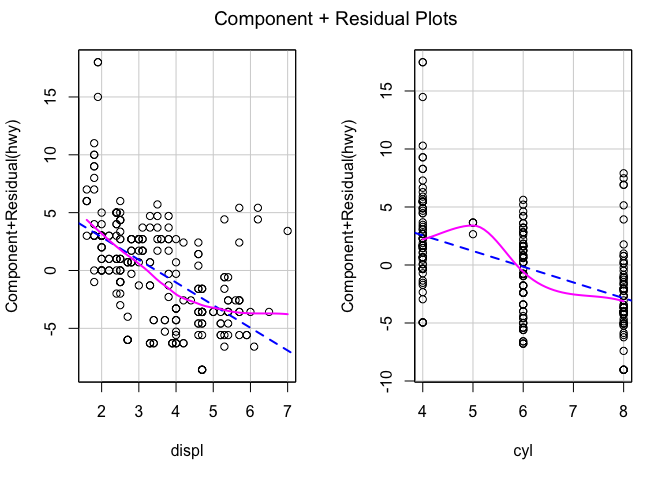

Lecture 14 Examples
================
Christopher Prener, Ph.D.
(November 26, 2018)

## Introduction

This notebook provides examples of the syntax described in Lecture 14.

## Dependencies

This notebook requires quite a few packages for assessing regression
models:

``` r
# tidyverse packages
library(dplyr)      # data wrangling
```

    ## 
    ## Attaching package: 'dplyr'

    ## The following objects are masked from 'package:stats':
    ## 
    ##     filter, lag

    ## The following objects are masked from 'package:base':
    ## 
    ##     intersect, setdiff, setequal, union

``` r
library(ggplot2)    # mpg data
library(tibble)     # data wrangling

# statistics packages
library(car)        # regression diagnostics
```

    ## Loading required package: carData

    ## 
    ## Attaching package: 'car'

    ## The following object is masked from 'package:dplyr':
    ## 
    ##     recode

``` r
library(heplots)    # effect sizes
library(lmtest)     # white's test
```

    ## Loading required package: zoo

    ## 
    ## Attaching package: 'zoo'

    ## The following objects are masked from 'package:base':
    ## 
    ##     as.Date, as.Date.numeric

``` r
library(sandwich)   # robust standard errors

# other packages
library(here)       # file path management
```

    ## here() starts at /Users/chris/GitHub/SOC5050/LectureRepos/lecture-14

``` r
library(stargazer)  # regression output
```

    ## 
    ## Please cite as:

    ##  Hlavac, Marek (2018). stargazer: Well-Formatted Regression and Summary Statistics Tables.

    ##  R package version 5.2.2. https://CRAN.R-project.org/package=stargazer

To simplfy printing output, we’re going to define a quick function. For
each of the tests we’re using, we’ll store the id numbers of problematic
observations in an object. We’ll then print the data for each
problematic observation:

``` r
printObs <- function(.data, values){
  
  .data %>%
    filter(row_number() %in% values) %>%
    select(id, manufacturer, model, hwy, displ, cyl)
  
}
```

## Load Data

This notebook requires data from the `ggplot2` package:

``` r
autoData <- mpg
```

## Initial Modeling

### Model 1

This model estimates the effect of engine size on highway fuel
efficiency:

``` r
model1 <- lm(hwy ~ displ+cyl, data = autoData)
```

As a quick review, we can view the model’s main findings with the
`summary()` function:

``` r
summary(model1)
```

    ## 
    ## Call:
    ## lm(formula = hwy ~ displ + cyl, data = autoData)
    ## 
    ## Residuals:
    ##     Min      1Q  Median      3Q     Max 
    ## -7.5098 -2.1953 -0.2049  1.9023 14.9223 
    ## 
    ## Coefficients:
    ##             Estimate Std. Error t value Pr(>|t|)    
    ## (Intercept)  38.2162     1.0481  36.461  < 2e-16 ***
    ## displ        -1.9599     0.5194  -3.773 0.000205 ***
    ## cyl          -1.3537     0.4164  -3.251 0.001323 ** 
    ## ---
    ## Signif. codes:  0 '***' 0.001 '**' 0.01 '*' 0.05 '.' 0.1 ' ' 1
    ## 
    ## Residual standard error: 3.759 on 231 degrees of freedom
    ## Multiple R-squared:  0.6049, Adjusted R-squared:  0.6014 
    ## F-statistic: 176.8 on 2 and 231 DF,  p-value: < 2.2e-16

Both displacement (\(\beta = -1.960, p = 0.0002\)) and the number of
cylinders (\(\beta = -1.354, p = 0.001\)) are associated with decreases
in fuel efficiency - as engine size increases, fuel efficiency
decreases. These two factors explain approximately 60% of the variance
in highway fuel efficiency.

### New Operators

In order to assess the fit and assumptions for model 1, we need a few
new tools. The first is `which()`, which prints row numbers for
observations that fit a particular condition:

``` r
(highmpg <- which(autoData$hwy > 40))
```

    ## [1] 213 222 223

There are three observations that have a highway fuel effiency of more
than 40 miles per gallon - rows 213, 222, and 223.

We can easily subset using these values if we wanted to see some details
about them. The `%in%` operator creates a logical test - are values in a
given set listed *in* an object. In this case, we test whether any of
the row numbers are listed in the `highmpg` object we created above.

``` r
filter(autoData, row_number() %in% highmpg)
```

    ## # A tibble: 3 x 11
    ##   manufacturer model displ  year   cyl trans drv     cty   hwy fl    class
    ##   <chr>        <chr> <dbl> <int> <int> <chr> <chr> <int> <int> <chr> <chr>
    ## 1 volkswagen   jetta   1.9  1999     4 manu… f        33    44 d     comp…
    ## 2 volkswagen   new …   1.9  1999     4 manu… f        35    44 d     subc…
    ## 3 volkswagen   new …   1.9  1999     4 auto… f        29    41 d     subc…

The three highest fuel effieciency vehicles are late 1990s era
Volkswagen models.

We can also create an ID number column from the row numbers. This will
be useful later:

``` r
autoData %>%
  rowid_to_column("id") %>%
  select(id, everything()) -> autoData
```

This new column’s values are based entirely on the sort order - if the
sort order changes, these values will be applied differently.

## Checking Assumptions

### Non-Linearity

We can use scatterplots with regression lines fit to test for
non-linearity. We can also use component+residual plots, which plot the
residuals from a given independent variable against the dependent
variable. The plots show the best fit line for both the residuals and
the component (a hypothetical linear relationship) - the larger the
difference between these two lines, the less confident we can be that a
linear model is most appropriate for these data.

This is the plot for our model:

``` r
crPlots(model1)
```

<!-- -->

The plot on the left is the one we’ll focus on since it is continuous.
You can see the pink line deviate upwards on the right side of the plot-
that is the impact of sports cars that we have noted in past
explorations of these data. Overall, these plots do not suggest that
non-linearity is a serious concern. If it were, we would want to
statistically transform these variables (such as taking the square root,
squaring, or taking the natural log).

In large models, it is more useful to print one plot at a time for the
continuous relationships:

``` r
crPlot(model1, variable="displ")
```

<!-- -->

### Outlier Detection

The Bonferonni test will identify outliers by observation. The
`outlierTest()` output will show statistically significant observations,
each of which is considered an outlier:

``` r
outlierTest(model1)
```

    ##     rstudent unadjusted p-value Bonferonni p
    ## 213 4.127028         5.1401e-05     0.012028
    ## 222 4.127028         5.1401e-05     0.012028

We can learn more about these observations by extracting the row numbers
from the output and then using `filter()` along with the `row_number()
%in%` syntax we’ve used above:

``` r
bonferonni <- outlierTest(model1)
bonferonni <- as.numeric(attr(bonferonni$p, "names"))

printObs(autoData, bonferonni)
```

    ## # A tibble: 2 x 6
    ##      id manufacturer model        hwy displ   cyl
    ##   <int> <chr>        <chr>      <int> <dbl> <int>
    ## 1   213 volkswagen   jetta         44   1.9     4
    ## 2   222 volkswagen   new beetle    44   1.9     4

Two of the Volkswagen vehicles are identified as outliers here. These
are the two vehicles with the highest fuel efficiency in the data set:

``` r
autoData %>%
  arrange(desc(hwy)) %>%
  select(id, manufacturer, model, hwy, displ, cyl)
```

    ## # A tibble: 234 x 6
    ##       id manufacturer model        hwy displ   cyl
    ##    <int> <chr>        <chr>      <int> <dbl> <int>
    ##  1   213 volkswagen   jetta         44   1.9     4
    ##  2   222 volkswagen   new beetle    44   1.9     4
    ##  3   223 volkswagen   new beetle    41   1.9     4
    ##  4   197 toyota       corolla       37   1.8     4
    ##  5   106 honda        civic         36   1.8     4
    ##  6   107 honda        civic         36   1.8     4
    ##  7   196 toyota       corolla       35   1.8     4
    ##  8   198 toyota       corolla       35   1.8     4
    ##  9   105 honda        civic         34   1.8     4
    ## 10   100 honda        civic         33   1.6     4
    ## # ... with 224 more rows

Before we move on, we’ll want to note the id numbers for the two
observations for later.

### Unusual Observations

We have three techniques at our disposal for identifying observations
that are “unusual” in some way - i.e. they exert too much influence on
the model because of their particular combination of values.

#### Leverage

To calculate leverage, we’ll use the equation:

\(\frac{2*p}{n}\)

We can calculate \(p\) (the number of parameters) and \(n\) (the number
of observations in the model) automatically using the syntax below - we
need to pull information from the `model1` object.

``` r
p <- as.numeric(length(attr(model1$coefficients, "names")))
n <- as.numeric(nrow(model1$model))

leveragePoints2 <- which(hatvalues(model1) > (2*p)/n)

printObs(autoData, leveragePoints2)
```

    ## # A tibble: 7 x 6
    ##      id manufacturer model                hwy displ   cyl
    ##   <int> <chr>        <chr>              <int> <dbl> <int>
    ## 1    23 chevrolet    c1500 suburban 2wd    17   6       8
    ## 2    26 chevrolet    corvette              26   6.2     8
    ## 3    27 chevrolet    corvette              25   6.2     8
    ## 4    28 chevrolet    corvette              24   7       8
    ## 5    32 chevrolet    k1500 tahoe 4wd       17   6.5     8
    ## 6   130 jeep         grand cherokee 4wd    14   6.1     8
    ## 7   131 land rover   range rover           15   4       8

We can calculate a more conservative measure of leverage using the
following equation:

\(\frac{3*p}{n}\)

We’ll use the same values for \(p\) and \(n\) we’ve stored earlier:

``` r
leveragePoints3 <- which(hatvalues(model1) > (3*p)/n)

printObs(autoData, leveragePoints3)
```

    ## # A tibble: 2 x 6
    ##      id manufacturer model             hwy displ   cyl
    ##   <int> <chr>        <chr>           <int> <dbl> <int>
    ## 1    28 chevrolet    corvette           24   7       8
    ## 2    32 chevrolet    k1500 tahoe 4wd    17   6.5     8

We can see that there are two observations with a high degree of
leverage on the model and another five that have a smaller but still
notable amount of leverage. These observations tend to be vehicles with
very large engines, the highest number of cylinders, and very low
highway fuel efficiency. We’ll note the observation numbers for both
sets of leverage output as we did for outliers above.

We can also display these visually using the following syntax:

``` r
plot(hatvalues(model1))
abline(h = c(2,3)*p/n, col="red", lty=2)
```

<!-- -->

We can see that there are another 5 observations that very nearly cross
the threshold into being “high leverage” observations.

#### Cook’s Distance

Cook’s distance is an alternative measure of influence. We are
particularly concerned about observations that have a value for Cook’s
distance greater than 1:

``` r
cooksD1 <- which(cooks.distance(model1) > 1)

printObs(autoData, cooksD1)
```

    ## # A tibble: 0 x 6
    ## # ... with 6 variables: id <int>, manufacturer <chr>, model <chr>,
    ## #   hwy <int>, displ <dbl>, cyl <int>

The `0 rows` output means that there are no observations that meet this
criteria.

We should also be concerned about observations that have a Cook’s
distance greater than .5:

``` r
cooksDHalf <- which(cooks.distance(model1) > .5)

printObs(autoData, cooksDHalf)
```

    ## # A tibble: 0 x 6
    ## # ... with 6 variables: id <int>, manufacturer <chr>, model <chr>,
    ## #   hwy <int>, displ <dbl>, cyl <int>

Again, there are no observations that meet this criteria.

We can visual the Cook’s distance values with the following syntax:

``` r
plot(cooks.distance(model1))
abline(h = c(1, .5), col="red", lty=2)
```

<!-- -->

We don’t see either of our red lines because none of the observations
meet the criteria of being greater than .5 or 1. We should, however,
note observations that do not cross this threshold but are outliers
relative to the other observations in the data set. There are three
points that stand out, and we can identify them by setting our value for
Cook’s distance based on the y axis of the plot:

``` r
cooksDBorderline <- which(cooks.distance(model1) > .08)

printObs(autoData, cooksDBorderline)
```

    ## # A tibble: 3 x 6
    ##      id manufacturer model      hwy displ   cyl
    ##   <int> <chr>        <chr>    <int> <dbl> <int>
    ## 1    26 chevrolet    corvette    26   6.2     8
    ## 2    27 chevrolet    corvette    25   6.2     8
    ## 3    28 chevrolet    corvette    24   7       8

These three borderline values should be noted for later reference.

#### Influence Plots

The influence plot combines measures of Cook’s Distance and “studentized
resiudals” (residuals converted to \(t\) values) and notes particularly
extreme observations:

``` r
influence <- influencePlot(model1)
```

<!-- -->

The plot shows us the comparison of our estimated values with the
studentized resiudals. Sometimes the output is difficult to read,
however, so it is easier to store the row numbers and print the
corresponding observations:

``` r
influenceObs <- as.integer(row.names(influence))

printObs(autoData, influenceObs)
```

    ## # A tibble: 5 x 6
    ##      id manufacturer model             hwy displ   cyl
    ##   <int> <chr>        <chr>           <int> <dbl> <int>
    ## 1    26 chevrolet    corvette           26   6.2     8
    ## 2    28 chevrolet    corvette           24   7       8
    ## 3    32 chevrolet    k1500 tahoe 4wd    17   6.5     8
    ## 4   213 volkswagen   jetta              44   1.9     4
    ## 5   222 volkswagen   new beetle         44   1.9     4

We have five observations that have a high degree of influence on our
model. Again, we’ll note the observation numbers before moving on.

### Normality of Residuals

Our model’s residuals should be normally distributed. The `car` package
contains a special `qqPlot` function for assessing this, which includes
additional lines on the plot for assessing deviations from normality:

``` r
qqplot <- qqPlot(model1)
```

<!-- -->

We can print the observations identified as problematic using the
`qqplot` object we’ve created above:

``` r
printObs(autoData, qqplot)
```

    ## # A tibble: 2 x 6
    ##      id manufacturer model        hwy displ   cyl
    ##   <int> <chr>        <chr>      <int> <dbl> <int>
    ## 1   213 volkswagen   jetta         44   1.9     4
    ## 2   222 volkswagen   new beetle    44   1.9     4

As before, we’ll note the problematic observations. We’ll also want to
note that our residuals are not normally distributed.

### Homoskedastic Errors

We want the variance in our residual error to be constant
(i.e. heteroskedastic). We can use both a hypothesis test and a plot to
diagnose possible homoskedastic error.

#### Breusch-Pagan Test

If the residuals are normally distributed, then we want to use the the
Breusch-Pagan Test to diagnose homoskedasticity:

``` r
bptest(model1)
```

    ## 
    ##  studentized Breusch-Pagan test
    ## 
    ## data:  model1
    ## BP = 8.5133, df = 2, p-value = 0.01417

The statistically significant result here is *not* the most appropriate
one to assess for our model give then prior results of the `qqPlot()`.
Nevertheless, we can interpret the findings as a suggestion that
homoskedasticity is a concern given the results of the Breusch-Pagan
Test (\(BP = 8.513, p = 0014\)).

#### White’s Test

If the residuals are not normally distributed, then we want to use the
White’s Test variant of the Breusch-Pagan Test.

``` r
bptest(model1, ~ displ * cyl + I(displ^2) + I(cyl^2), data = autoData)
```

    ## 
    ##  studentized Breusch-Pagan test
    ## 
    ## data:  model1
    ## BP = 16.022, df = 5, p-value = 0.00678

The statistically significant result here is the most appropriate one to
assess for our model give then prior results of the `qqPlot()`. The
White’s test (\(BP = 16.022, p = 0.007\)) suggests that homoskedasticity
is a concern.

#### Residual Plot

When we create a residual plot, we are looking for any narrowing across
the plot (see lecture slides).

``` r
plot(model1, which = 1)
```

<!-- -->

This plot shows a small degree of narrowing, suggesting that
homoskedasticity is present but not a significant conern. The plot
identifies three observations - 213, 222, and 223 (these are hard to
read) - that may be contributing to this condition. Since there is no
output to save, we can create our own object:

``` r
homoskedastic <- c(213, 222, 223)

printObs(autoData, homoskedastic)
```

    ## # A tibble: 3 x 6
    ##      id manufacturer model        hwy displ   cyl
    ##   <int> <chr>        <chr>      <int> <dbl> <int>
    ## 1   213 volkswagen   jetta         44   1.9     4
    ## 2   222 volkswagen   new beetle    44   1.9     4
    ## 3   223 volkswagen   new beetle    41   1.9     4

Again, we can note these observations for later.

### Auto-Correlation

The Durbin-Watson Test identifies the presence of auto-correlation in
our model - the residuals are correlated with each other:

``` r
durbinWatsonTest(model1)
```

    ##  lag Autocorrelation D-W Statistic p-value
    ##    1        0.534405     0.9284804       0
    ##  Alternative hypothesis: rho != 0

The results of the Durbin-Watson Test (\(DW = 0.928, p < .001\)) suggest
that auto-correlation is a concern.

*If you are using data measured in space, such as at the census tract
level, you want to be sensitive to spatial autocorrelation as well. This
occurs when observations are clustered near other like observations.
Moran’s I is used to diagnose this condition and can be calculated in
`R`, though I prefer the Python implementation from the `pysal`
package.*

### Multi-Collinearity

We use the square root of the variance inflation factor (“VIF”) to
identify multi-collinearity. Individual values should be less than 10:

``` r
sqrt(vif(model1))
```

    ##    displ      cyl 
    ## 2.724912 2.724912

This measure indicates that multi-collinearity is not a significant
concern. We also want our mean VIF to be less than 1:

``` r
mean(sqrt(vif(model1)))
```

    ## [1] 2.724912

This indicates that there is some minimal concern that our average level
of multicollinearity is high but not problematically so. We could look
for alternative model specifications if this were a more significant
concern (by either creating scales or by changing the specific
independent variables used).

## Adjusting Models

We need to deal with a number of problematic observations - 26, 27, 28,
32, 213, and 222. We also need to deal with broader model specification
issues related to auto-correlation and multi-collinearity.

### Fitting on a Subset

First, we want to create a subset of our data that does not include
potentially problematic observations.

``` r
flaggedObs <- c(26, 27, 28, 32, 213, 222)

autoData %>%
  mutate(insample = ifelse(id %in% flaggedObs, TRUE, FALSE)) %>%
  filter(insample == FALSE) %>%
  select(-insample) -> autoDataSub

model2 <- lm(hwy ~ displ+cyl, data = autoDataSub)

aic2 <- round(AIC(model2), digits = 3)
bic2 <- round(BIC(model2), digits = 3)
```

We want to compare two things: (1) has the overall “story” of the model
change in terms of significance, direction of betas, and adjsuted
r-squared as well as (2) has model fit improved. This is easiest to
assess in a formatted table, which we’ll create using `stargazer`.

Before we create the table, we need to calculate AIC and BIC values for
model 1:

``` r
aic1 <- round(AIC(model1), digits = 3)
bic1 <- round(BIC(model1), digits = 3)
```

Now we’re ready to create the table:

``` r
stargazer(model1, model2,
  title = "Regression Results",
  add.lines = list(c("AIC", aic1, aic2),c("BIC", bic1, bic2)), 
  omit.stat = "rsq", df = FALSE, 
  type = "html", out = here("examples", "models.html"))
```

We can see that there have been shifts in the magnitude of the betas -
the estimated effect of displacement on highway fuel efficiency has
increased while the estimated effect of cylinder count has shrunk
considerably. The standard errors on both betas have also shrunk. We
also see across the board improvements in model fit (judged by AIC, BIC,
and root mean squared error). Model 2 therefore appears to be a better
fit than Model 1.

### Follow-up

We’ll want to do follow-up on whether normality, homoskedasticity, and
auto-correlation remain concerns in model 2. If there are any
outstanding concerns, we’ll want to fit our model using robust standard
errors. We’ll start with normality:

``` r
qqPlot(model2)
```

<!-- -->

    ## [1]  24 217

This suggests we (a) still have concerns about our residuals’
distribution and (b) should use the White’s Test to follow-up on
homoskedasticity:

``` r
bptest(model2, ~ displ * cyl + I(displ^2) + I(cyl^2), data = autoDataSub)
```

    ## 
    ##  studentized Breusch-Pagan test
    ## 
    ## data:  model2
    ## BP = 3.8338, df = 5, p-value = 0.5736

The results of the White’s Test (\(BP = 3.834, p = 0.574\)) suggest that
we have managed concerns with homoskedasticity. Finally, we’ll check on
auto-correlation for the new model:

``` r
durbinWatsonTest(model2)
```

    ##  lag Autocorrelation D-W Statistic p-value
    ##    1       0.4893854      1.016667       0
    ##  Alternative hypothesis: rho != 0

The results of the Durbin-Watson Test (\(DW = 1.017, p < 0.001\))
suggest that auto-correlation remains a concern. We should therefore fit
our final model using robust standard errors.

### Robust Standard Errors

We can calculate an alternative set of standared errors and p-values
using `coeftest` and an alternative covariance matrix estimate that
gives us a more conservative estimate of statistical significance:

``` r
coeftest(model2, vcov = vcovHC(model2, "HC3"))
```

    ## 
    ## t test of coefficients:
    ## 
    ##             Estimate Std. Error t value  Pr(>|t|)    
    ## (Intercept) 37.26018    0.94282 39.5199 < 2.2e-16 ***
    ## displ       -2.98126    0.48570 -6.1381 3.733e-09 ***
    ## cyl         -0.64042    0.37304 -1.7168    0.0874 .  
    ## ---
    ## Signif. codes:  0 '***' 0.001 '**' 0.01 '*' 0.05 '.' 0.1 ' ' 1

We see here that the `cyl` results are not statisticaly significant to
at least the \(p < .05\) level. These output cannot be fed to
`stargazer()`, so you should manually change the standard errors and
p-values on a copy of the output you created above.

## Effect Sizes

Finally, we want to identify the “real world” significance of our
findings by using eta-squared effect sizes:

``` r
etasq(model2, partial = FALSE)
```

    ##                eta^2
    ## displ     0.13522785
    ## cyl       0.01042765
    ## Residuals         NA

The effect of displacement on highway fuel efficiency is moderate, while
the effect of cylinder size is quite small.
